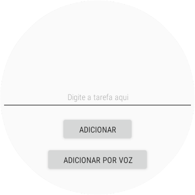

## Projeto Wear OS

Este projeto tem como objetivo demonstrar como as tecnologias wearables podem criar soluções acessíveis e inclusivas por meio de aplicações práticas. Neste aplicativo, os usuários podem visualizar uma lista de tarefas e cadastrar novas tarefas por comando de voz, além de poder ouvi-las.

## Recursos

- Linguagem de programação Java; 
- JDK 17;
- Android Studio 2023.1.1;
- Versionado através do Git / Github; 


## Tela Inicial


## Tela de Adição de Tarefa




## Adição por Voz


##  Procedimentos para utilizar o aplicativo:

```
1 - O Android Studio precisa está devidamente configurado em seu equipamento.
2 - Crie um dispositivo virtual Wear OS no Android Studio.
3 - Baixe os fontes do aplicativo e abra no Android Studio.
4 - Execute o aplicativo no dispositivo virtual Wear OS criado.
```
<hr>
